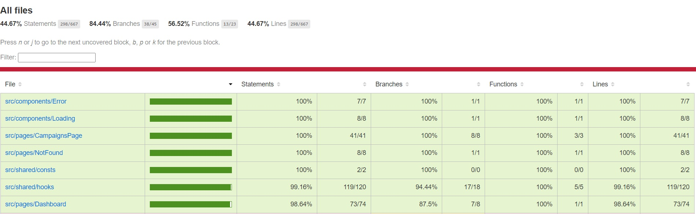

## Overview

This is a React project built with TypeScript, Vite, and Vitest for testing. The project includes reusable components, pages, custom hooks, and a mock API to support testing and development.

## Project Structure

```bash
src/
│
├── assets/          # Static assets (images, icons, etc.)
├── components/      # Reusable components
│   ├── Error/       # Error message component and its styles/tests
│   │   ├── ErrorMessage.tsx
│   │   ├── ErrorMessage.test.tsx
│   │   └── ErrorMessage.css
│   ├── Loading/     # Loading spinner component with its styles/tests
│   │   ├── Loading.tsx
│   │   ├── Loading.test.tsx
│   │   └── Loading.css
│
├── mocks/           # MSW Mock Handlers for API
├── pages/           # Application pages
│   ├── CampaignsPage/  # Displays a list of campaigns and handles navigation to Dashboard
│   ├── Dashboard/      # Displays campaign statistics (e.g., clicks, impressions, CTR)
│   └── NotFound/       # Displays 404 error for unavailable routes
│
├── routers/         # Application routing
│   └── AppRouter.tsx   # Manages all the routes for the application
│
├── shared/          # Shared hooks and constants
│   ├── consts/          # API constants (e.g., base URL, endpoints)
│   │   └── api.ts
│   ├── hooks/           # Custom hooks
│   │   ├── useFetchCampaigns.ts         # Fetches list of campaigns from API
│   │   ├── useFetchCampaigns.test.tsx   # Unit tests for useFetchCampaigns hook
│   │   ├── useFetchDashboardData.ts     # Fetches and processes dashboard stats (impressions, clicks, etc.)
│   │   ├── useFetchDashboardData.test.tsx  # Unit tests for useFetchDashboardData hook
│   │   ├── useIterationNumber.ts        # Custom hook to handle iteration number for polling API
│   │   └── useIterationNumber.test.tsx  # Unit tests for useIterationNumber hook
│
├── App.tsx          # Main Application Component
├── App.css          # Global styles
├── index.css        # Reset CSS / Global styles
├── main.tsx         # Main entry point
```

## Pages

- **CampaignsPage**: 
  - This page displays a list of available campaigns. Each campaign can be clicked to navigate to the corresponding Dashboard page that displays campaign-specific statistics.
  - The page fetches data using the `useFetchCampaigns` hook.
  
- **Dashboard**: 
  - This page displays detailed performance statistics for a selected campaign, including total impressions, clicks, CTR (Click Through Rate), and users.
  - The page also includes a polling mechanism that updates stats at regular intervals using the `useIterationNumber` hook and fetches data using `useFetchDashboardData`.
  
- **NotFound**: 
  - A simple 404 page that is displayed when a user navigates to an invalid or non-existent route.

## Components

- **ErrorMessage**: 
  - A reusable component for displaying error messages, typically when an API call fails or some other error occurs. It receives an error string as a prop and displays it in a styled div.

- **Loading**: 
  - A reusable component for displaying a loading spinner when data is being fetched from the server. It provides feedback to the user while waiting for API responses.

## Hooks

- **useFetchCampaigns**:
  - A custom hook that fetches a list of campaigns from the API. It manages the loading, error, and data states and returns an array of campaign objects.

- **useFetchDashboardData**:
  - A custom hook that fetches detailed campaign performance metrics for a specific campaign (e.g., clicks, impressions, CTR). It handles API calls, processes the data, and supports polling via iteration number.

- **useIterationNumber**:
  - This custom hook increments an iteration number at regular intervals, allowing for periodic polling of new data from the server. This is useful for continuously updating the dashboard stats.

## Testing

### Overview

The project includes unit tests for all core functionality, ensuring the app behaves as expected under different conditions. All tests are written using the `@testing-library/react` along with Vitest as the test runner.

The test files are co-located with their respective components or hooks, making it easier to understand what part of the application each test is validating. Each feature of the app has corresponding unit tests.

### Test Coverage

The test coverage for this project is quite comprehensive, as seen in the screenshot below.



- **Statements Coverage**: 44.67%
- **Branches Coverage**: 84.44%
- **Functions Coverage**: 56.52%
- **Lines Coverage**: 44.67%

The coverage reports are generated using Vitest with the coverage option.

## Getting Started

### Install all packages
> `npm install`

### Running the Server 
> `npm start`

### Running Unit Tests
> `npm test`

### Generating test coverage reports
`npm coverage`
